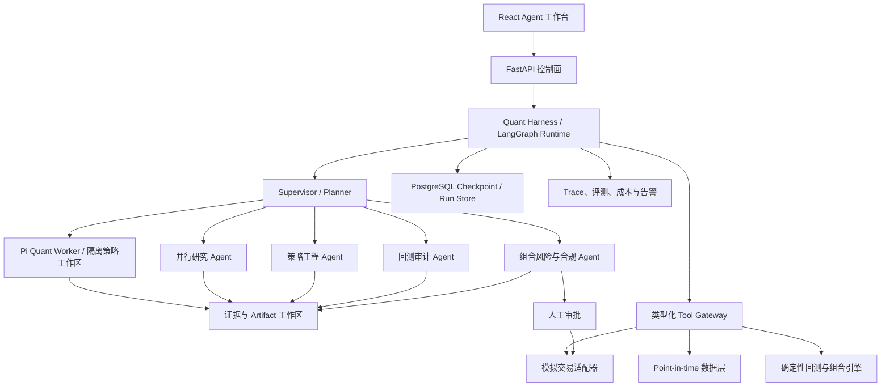

# Agent 股票量化系统升级方案

> 调研与设计日期：2026-08-14  
> 适用范围：`backend/`、`frontend/`、`TradingAgents-astock/` 及后续数据与任务基础设施  
> 产品定位：A 股投研、策略研究、回测和模拟交易系统；不直接把 LLM 输出视为投资建议或实盘指令。

## 一、结论

本项目已经具备升级基础：行情、指标、策略注册、统一回测、异步任务、AI 分析和一个 A 股特化的 TradingAgents fork。当前真正的问题不是“Agent 数量不够”，而是存在两套重复实现：

- `backend/app/agent/` 是手写的线性阶段编排，状态主要停留在单次进程和自由文本中。
- `TradingAgents-astock/` 已使用 LangGraph，并包含 7 类分析师、质量门控、多空辩论、风险辩论和 A 股规则，但尚未成为主系统的统一运行时。

建议采用 **LangGraph Control Plane + Pi Quant Worker + 自研 Quant Harness**。LangGraph 是唯一持久流程编排器；Pi 不再复制一套业务工作流，而是作为隔离的策略工程/深度研究执行器。主后端作为控制面和 API，`TradingAgents-astock` 收敛为领域引擎。LLM 负责提出假设、调用工具、解释证据和审查结果；行情计算、回测、组合约束与订单风控必须由确定性代码执行。

第一目标应是“可审计的 Agent 投研与策略实验平台”，然后依次开放模拟盘、影子盘，最后才评估受审批约束的实盘连接。

## 二、外部调研要点

### Harness 已成为 Agent 的核心

OpenAI 将 harness engineering 总结为：人定义意图和边界，Agent 执行；关键投入是让仓库知识、工具、日志、测试和反馈回路对 Agent 可见且可执行，而不是反复要求模型“更努力”。这正适合量化系统：将数据时间点、交易规则、回测门槛、风险预算和验收测试固化为机器可检查的环境。[OpenAI Harness Engineering](https://openai.com/index/harness-engineering/)

LangChain 当前把 Deep Agents 明确定义为 agent harness，内置规划、文件系统上下文、子 Agent、长时记忆与自动压缩，并运行在 LangGraph 之上。[Deep Agents Overview](https://docs.langchain.com/oss/python/deepagents/overview) LangGraph 自身提供持久化检查点、故障恢复、流式事件、time travel 和人工中断审批，适合长耗时的投研与回测任务。[LangGraph Persistence](https://docs.langchain.com/oss/python/langgraph/persistence)

OpenAI Agents SDK 也已提供工具、handoff、guardrails、session、HITL、MCP 和 tracing，说明这些能力已经成为生产 Agent runtime 的共同基线。[OpenAI Agents SDK](https://openai.github.io/openai-agents-python/) 但本项目已经深度使用 LangGraph，因此应借鉴这些能力，而非并存两套 runtime。

### Pi 适合作为轻量策略工作区，而不是交易控制面

最新 Pi 项目已迁移到 `earendil-works/pi`，核心包包括 `@earendil-works/pi-ai`、`pi-agent-core`、`pi-coding-agent` 和 vendor-neutral telemetry。它强调小核心，把工作流能力交给 Extensions、Skills、Prompt Templates 和 Packages；同时提供多模型、session/fork、JSON/RPC、工具 allowlist、`AGENTS.md` 上下文和自动 compaction。[Pi Agent Harness](https://github.com/earendil-works/pi) [Pi Coding Agent](https://github.com/earendil-works/pi/blob/main/packages/coding-agent/README.md)

这非常适合让一个 Agent 在独立工作区读取研究 artifact、生成 `StrategySpec`、运行受控测试并反复修正。但 Pi 官方明确说明它不内建文件、进程、网络或凭据权限系统，默认继承启动进程权限，强隔离需要容器或 sandbox。因此 Pi 不能直接持有生产数据库、券商凭据或无限制 Shell，也不应负责订单审批与 durable workflow。[Pi Permissions & Containerization](https://github.com/earendil-works/pi#permissions--containerization)

### TradingAgents 的最新变化值得选择性吸收

上游 TradingAgents 当前已到 v0.3.1，而本地包版本仍是 v0.2.4。上游近期加入结构化输出、LangGraph checkpoint resume、持久决策日志、数据访问契约、前视过滤、崩溃安全路由和 LLM 重试预算。[TradingAgents GitHub](https://github.com/TauricResearch/TradingAgents) 这些都是应优先回迁的正确性能力；不建议直接覆盖本地 A 股定制代码。

## 三、目标架构



### 1. Quant Harness

Harness 不是一个大 Prompt，而是一组强约束运行能力：

- **计划与预算：** 每次 run 生成步骤计划，限制最大轮次、工具调用、token、耗时和并发。
- **持久执行：** 每个节点写 checkpoint；进程重启后从最近成功节点恢复，外部调用使用幂等键。
- **上下文工程：** 原始大数据写入 artifact，不直接塞入对话；主 Agent 只接收结构化摘要和引用。长任务自动压缩，子 Agent 隔离上下文。
- **权限分级：** 只读行情工具默认开放；写策略、启动高成本回测需要策略权限；模拟下单需要人工审批；实盘默认禁用。
- **结构化契约：** Agent 输出必须通过 Pydantic schema，例如 `ResearchClaim`、`StrategySpec`、`BacktestVerdict`、`PortfolioProposal`，禁止靠正则从自然语言猜信号。
- **全链路证据：** 每个结论附 `source_id`、`as_of`、取数时间、vendor、数据版本和 tool call；没有证据只能标记为假设。

### 2. Agent 组织方式

不建议默认启动十几个 Agent。采用“一个 Supervisor + 按需专家”的动态路由：

| Agent | 职责 | 允许工具 | 输出 |
|---|---|---|---|
| Supervisor | 拆解目标、控制预算、选择专家、汇总结果 | run/artifact 查询 | `RunPlan`、最终报告 |
| Data QA | 检查缺失、复权、停牌、时间点和来源一致性 | 只读数据工具 | `DataQualityReport` |
| Research | 技术、基本面、新闻、政策和资金证据采集，可并行 | 只读研究工具 | `ResearchClaim[]` |
| Strategy Engineer | 把研究假设转换为无歧义规则和参数空间 | 策略 DSL、沙箱 | `StrategySpec` |
| Backtest Critic | 查前视偏差、过拟合、成本假设与稳健性 | 回测/统计工具 | `BacktestVerdict` |
| Portfolio Risk | 仓位、暴露、流动性和交易规则硬约束 | 组合与风险工具 | `PortfolioProposal` |

现有 Bull/Bear 和三方风险辩论可作为 Research/Critic 的可选模式，而不是所有请求的固定流水线。只有证据冲突或高风险提案才触发辩论，以降低成本和“多 Agent 一致性幻觉”。

### 3. Pi Quant Worker

Pi 作为 Node.js sidecar/worker，由 LangGraph 节点通过 RPC 或队列启动，不直接面向交易 API：

```text
LangGraph strategy_engineer node
  -> 创建 run workspace + 只读数据快照
  -> 启动容器化 Pi RPC session
  -> 加载量化 AGENTS.md / Skills / Extensions
  -> 生成或修改 StrategySpec + tests + research notes
  -> 调用受控 backtest extension
  -> 输出 artifact manifest
  -> LangGraph 校验 schema、保存 checkpoint、交给 Critic
```

建议设计：

- 每次运行创建 `/workspace/runs/{run_id}`；数据 snapshot 只读挂载，只有 `artifacts/` 可写。
- 启动时禁用内置 `bash/write/edit`，只允许自研扩展工具；需要代码实验时切换到无网络、无密钥、限 CPU/内存/时长的 sandbox profile。
- 编写 `factor-research`、`strategy-spec-authoring`、`backtest-audit` 三个项目级 Skill；`AGENTS.md` 固化 A 股规则、禁止项和验收命令。
- Pi Extension 只调用 Tool Gateway，不直连数据库；返回值继续使用与 Python 端相同的 JSON Schema。
- 将 Pi `session_id`、分支、compaction 摘要和 artifact checksum 写入 `agent_steps`；LangGraph checkpoint 才是全局事实源。
- 使用 RPC/JSON 事件映射到现有前端 timeline；不要另起一套 Pi TUI 作为用户主界面。
- 固定 Pi 版本和 package commit，第三方扩展逐个审计。Pi package/extension 可执行任意代码，不能在生产环境自动更新。

Pi 的最佳用途是“长上下文、会读写 artifact、会迭代验证的策略工程师”；普通行情问答、固定分析图、风险审批继续由 Python/LangGraph 完成。这样既获得 Pi 的轻量 agent loop 和上下文管理，也避免跨语言双状态机。

### 4. Tool Gateway 与 MCP

先把内部 Python 能力包装成严格类型化工具，再决定是否通过 MCP 暴露。建议工具域：

- `market.*`：K 线、快照、交易日历、复权因子、停牌和涨跌停状态。
- `fundamental.*`：财报、估值、公司行动，必须携带公告期和可获知日期。
- `event.*`：公告、新闻、政策、龙虎榜、解禁；返回来源、时间和原文引用。
- `factor.*`：因子计算、截面标准化、中性化、IC/RankIC。
- `strategy.*`：校验/保存 `StrategySpec`，禁止执行任意宿主代码。
- `backtest.*`：提交、取消、读取结果、walk-forward、压力测试和基准比较。
- `portfolio.*`：风险预算、行业/个股暴露、换手和容量估算。
- `execution.paper.*`：模拟委托、撤单和持仓；全部写操作可审计。

第三方 MCP 工具必须经过 allowlist、参数校验、超时、输出大小限制和敏感字段脱敏。Agent 不应直接获得数据库写权限或生产 Shell。

## 四、量化正确性底座

Agent 只能建立在可信数据和回测上，优先级高于增加模型或角色。

### 数据层

- 建立统一 `MarketDataProvider` 接口，将 mootdx、AkShare、腾讯等放在 adapter 后面，记录 vendor 和失败切换。
- 所有研究 run 固定 `data_snapshot_id` 与 `as_of`，支持结果重放。
- 补齐前复权/后复权/不复权语义、交易日历、停牌、ST、退市、分红拆股和成分股历史，避免幸存者偏差。
- 新闻和财报按“市场当时可获得时间”入库，不能仅使用报告期或文章日期。
- 原始层不可变，清洗层和特征层带 schema/version；生产建议 PostgreSQL + TimescaleDB/ClickHouse，早期可继续 SQLite + Parquet 验证接口。

### 策略与回测

- 用声明式 `StrategySpec` 描述 universe、signal、rebalance、position sizing、risk constraints 和 cost model。
- 回测必须模拟 A 股 T+1、100 股一手、涨跌停无法成交、停牌、手续费、印花税、滑点和成交量容量。
- 默认输出训练/验证/样本外、walk-forward、参数敏感性和压力测试；禁止只展示最优参数。
- 推广门槛至少包括：无前视检查通过、样本外收益/回撤达标、相对基准稳定、换手与容量可接受、多个市场阶段不过度失效。
- LLM 只能提出策略和解释结果，不能修改回测结果或绕过风险规则。

## 五、状态、记忆与 Artifact 模型

建议新增以下核心实体：

| 实体 | 关键字段 |
|---|---|
| `agent_runs` | `run_id`、目标、状态、预算、`thread_id`、`snapshot_id`、prompt/model/harness 版本 |
| `agent_steps` | 节点、输入摘要、输出 schema、重试、耗时、token、错误 |
| `tool_calls` | 工具和版本、参数 hash、权限、结果引用、耗时、状态 |
| `artifacts` | 类型、URI、checksum、来源、`as_of`、schema version |
| `approvals` | 动作、风险摘要、审批人、决定、时间、过期时间 |
| `evaluations` | 数据集版本、scorer、分数、阈值、回归结果 |

短期记忆属于单次 run；长期记忆只保存经过验证的事实、用户偏好和失败经验，并带来源与失效时间。不要把模型自由文本直接写成“事实记忆”。

## 六、评测 Harness 与可观测性

每次模型、Prompt、工具或数据源升级都必须跑固定评测集。MLflow 当前支持从完整 trace 构造评测数据集、记录人工反馈，并度量质量、延迟与 token 成本，可作为自托管起点。[MLflow Agent Evaluation](https://mlflow.org/docs/latest/genai/eval-monitor)

建议建立四层门禁：

1. **确定性单测：** schema、工具参数、A 股成交规则、时间点、成本和风险约束。
2. **Golden cases：** 30–50 个覆盖牛熊震荡、停牌、涨跌停、财报发布、解禁和数据缺失的历史案例。
3. **Agent trace 评分：** 证据覆盖率、引用正确率、工具选择、计划完成率、幻觉率、恢复成功率、成本和 P95 延迟。
4. **量化结果门禁：** 前视/幸存者偏差检查、样本外指标、稳健性、容量和最大回撤；LLM judge 不能替代这些代码评分。

每个 run 在前端显示时间线：计划、各 Agent、工具调用、证据、checkpoint、审批、成本和最终产物。默认关闭敏感 trace 内容或先脱敏；OpenAI Agents SDK 的 tracing 文档同样特别提供敏感数据开关，说明这一点不能依赖日志约定。[OpenAI Agents Tracing](https://openai.github.io/openai-agents-python/tracing/)

## 七、仓库改造建议

### 代码边界

```text
backend/app/
  agent_runtime/       # LangGraph runtime、checkpoint、budget、approval、events
  agent_api/           # run/stream/resume/cancel/artifact/evaluation API
  domain/              # StrategySpec、ResearchClaim、PortfolioProposal 等 schema
  tools/               # 类型化工具与权限策略
  services/            # 行情、因子、回测、组合等确定性服务
pi-worker/
  extensions/          # 仅暴露 Tool Gateway 与 artifact 工具
  skills/              # 因子研究、StrategySpec、回测审计
  AGENTS.md             # A 股规则、权限边界、验收命令
  package.json          # 固定 Pi 与扩展版本
TradingAgents-astock/
  tradingagents/       # A 股 Agent 图和角色；作为 workspace package 被 backend 调用
frontend/src/
  pages/AgentWorkspace.tsx
  components/agent/    # Run timeline、evidence、approval、artifact、cost
evals/
  datasets/            # 版本化案例与期望
  scorers/             # 确定性与模型评分器
```

- 废弃 `backend/app/agent/orchestrator.py` 的重复线性流程，API 通过 adapter 调用统一 LangGraph runtime。
- 新增 `pi-worker` sidecar，但不让它维护独立业务状态；由 LangGraph 分配任务、保存 checkpoint 和执行审批。
- 从上游 v0.3.1 选择性回迁 checkpoint resume、结构化输出、决策日志、数据契约、前视过滤、路由容错和重试预算。
- 保留本地政策、游资、解禁、A 股交易规则和质量门控；先用差异测试证明行为，再合并上游变更。
- 当前 job 线程执行迁移到独立 worker；MVP 可用 ARQ/RQ + Redis，长期任务状态和 checkpoint 落 PostgreSQL。
- 前端由“提交后轮询结果”升级为 SSE/WebSocket 事件流，同时保留断线后按 `run_id` 恢复。

## 八、分阶段路线图

### Phase 0：可信基础（1–2 周）

- 修复现有前端 build、Alembic 链、mootdx/httpx 依赖冲突和全项目测试基线。
- 定义六个核心 Pydantic schema 和统一 `as_of`/`source_id` 数据契约。
- 为当前 Agent 流程建立 10 个 golden cases，记录基准成本、耗时和质量。

**完成标准：** 一条命令安装和测试；同一 snapshot 可重复得到相同确定性指标；所有 Agent 输出可校验。

### Phase 1：统一 Runtime（2–3 周）

- 将 `TradingAgents-astock` 接入 FastAPI，删除主后端重复编排。
- 增加 PostgreSQL checkpointer、run/step/tool/artifact 表、取消与恢复 API。
- 增加预算、超时、重试、并发、工具 allowlist 和事件流。

**完成标准：** 任意节点中断后可恢复；刷新页面不丢进度；每条结论能追到数据和工具调用。

### Phase 2：Quant Harness（3–4 周）

- 上线 Supervisor 动态规划、并行 Research、Strategy Engineer 和 Backtest Critic。
- 建设 artifact workspace、上下文压缩、策略沙箱与声明式 StrategySpec。
- 完成 Pi Quant Worker POC：RPC 事件流、3 个项目 Skill、受限 Extensions、容器隔离和 artifact manifest。
- 加入 walk-forward、数据泄漏审计、参数敏感性与组合风险硬门禁。

**完成标准：** 用户可从自然语言目标生成可审阅策略，经自动回测和审计后输出“通过/拒绝及原因”，不能自动进入交易。

### Phase 3：模拟盘闭环（3–4 周）

- 建设 paper broker、持仓/现金/订单事件、盘前计划和盘后归因。
- Agent 提议订单，确定性风控校验，人工批准后才进入模拟盘。
- 对信号漂移、数据延迟、provider 失败、成本和回撤设置告警。

**完成标准：** 连续运行至少 4–8 周；断线/重启可恢复；每笔模拟订单可重放并解释。

### Phase 4：受控实盘（后续单独立项）

只有在模拟盘、合规和运维指标持续达标后再评估。中国证监会的程序化交易规定已明确报告管理、交易监测和风险管理要求，因此实盘连接必须单独完成券商接口、身份权限、报备、限频、熔断、审计和应急预案评审。[证监会《证券市场程序化交易管理规定（试行）》](https://www.csrc.gov.cn/csrc/c101954/c7480579/7480579/files/%E9%99%84%E4%BB%B61%EF%BC%9A%E8%AF%81%E5%88%B8%E5%B8%82%E5%9C%BA%E7%A8%8B%E5%BA%8F%E5%8C%96%E4%BA%A4%E6%98%93%E7%AE%A1%E7%90%86%E8%A7%84%E5%AE%9A%EF%BC%88%E8%AF%95%E8%A1%8C%EF%BC%89.pdf)

## 九、MVP 建议

第一个可交付版本只做一个高价值闭环：

> 用户选择股票池与研究目标 → Supervisor 制定计划 → 专家并行采集有时间点的证据 → Agent 生成结构化策略 → 确定性回测 → Critic 检查偏差与稳健性 → Risk 给出仓位上限 → 人工保存或拒绝策略。

MVP 不做自动实盘、不做无限自主循环、不让 Agent 写任意生产代码、不把向量库当作事实数据库。建议验收指标：恢复成功率 100%，关键结论引用覆盖率 ≥95%，工具 schema 成功率 ≥99%，无前视检查 100% 通过，单次标准研究成本和 P95 耗时可配置且可见。

## 十、技术选择摘要

| 领域 | 推荐 | 暂不推荐 |
|---|---|---|
| Agent runtime | LangGraph 负责 durable workflow，Pi 只做无状态/可恢复 worker | 让 LangGraph 与 Pi 各自维护业务状态机 |
| Harness | Quant Harness + Pi Skills/Extensions + 隔离 workspace | 直接给金融 Agent 全功能 Shell 或宿主权限 |
| 状态 | PostgreSQL checkpoint + Redis worker | 进程内线程和内存状态 |
| 数据 | Provider adapter + point-in-time snapshot + Parquet/列式存储 | Agent 直接调用多个不稳定网页接口 |
| 输出 | Pydantic structured outputs + artifacts | 正则解析自由文本 Buy/Sell |
| 评测 | 确定性量化门禁 + trace eval + 人工抽检 | 只用 LLM judge 或看一次收益曲线 |
| 执行 | 研究 → 回测 → 模拟盘 → 审批实盘 | LLM 直接下单 |

## 参考资料

- [OpenAI：Harness engineering](https://openai.com/index/harness-engineering/)
- [OpenAI Agents SDK](https://openai.github.io/openai-agents-python/)
- [LangGraph：Persistence](https://docs.langchain.com/oss/python/langgraph/persistence)
- [LangGraph：Human-in-the-loop](https://docs.langchain.com/oss/python/langchain/human-in-the-loop)
- [LangChain：Deep Agents agent harness](https://docs.langchain.com/oss/python/deepagents/overview)
- [Pi Agent Harness 官方仓库](https://github.com/earendil-works/pi)
- [Pi Coding Agent：Skills、Extensions、Context Files](https://github.com/earendil-works/pi/blob/main/packages/coding-agent/README.md)
- [Pi Compaction and Branch Summarization](https://github.com/earendil-works/pi/blob/main/packages/coding-agent/docs/compaction.md)
- [TradingAgents 官方项目](https://github.com/TauricResearch/TradingAgents)
- [TradingAgents 研究框架说明](https://tradingagents-ai.github.io/)
- [MLflow：Agent Evaluation and Monitoring](https://mlflow.org/docs/latest/genai/eval-monitor)
- [中国证监会：证券市场程序化交易管理规定（试行）](https://www.csrc.gov.cn/csrc/c101954/c7480579/7480579/files/%E9%99%84%E4%BB%B61%EF%BC%9A%E8%AF%81%E5%88%B8%E5%B8%82%E5%9C%BA%E7%A8%8B%E5%BA%8F%E5%8C%96%E4%BA%A4%E6%98%93%E7%AE%A1%E7%90%86%E8%A7%84%E5%AE%9A%EF%BC%88%E8%AF%95%E8%A1%8C%EF%BC%89.pdf)
