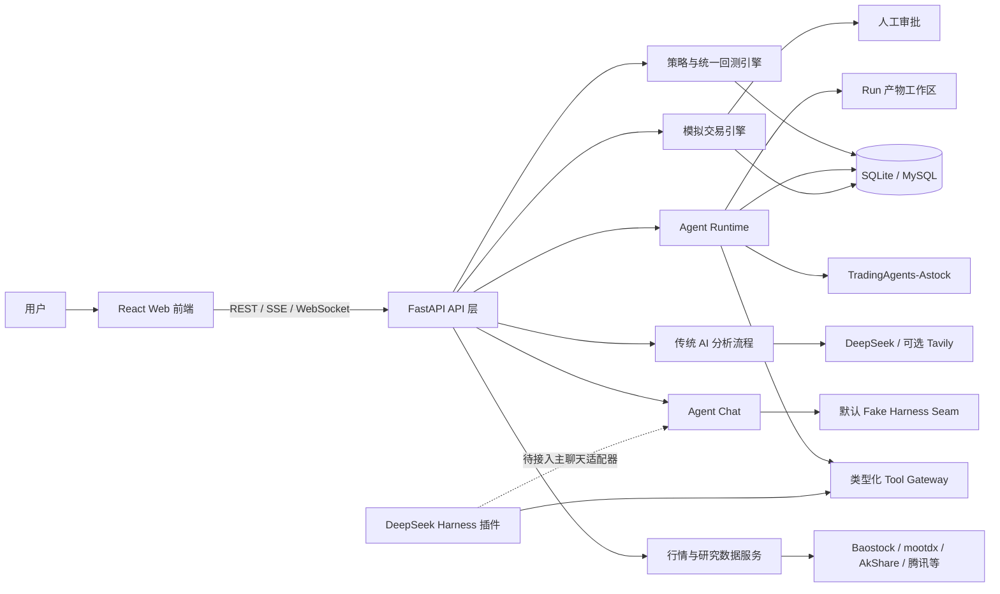

# Backing 项目全景介绍与功能路线图

> 项目阶段：研究、回测、Agent 工作台与模拟交易已形成完整骨架；生产部署、真实 Harness 对话接入和多用户能力正在完善

## 1. 项目定位

Backing 是一个面向 A 股的本地化量化研究与智能投研平台。它把行情数据、技术指标、股票筛选、策略研究、回测、AI 个股分析、多智能体研究、人工审批和模拟交易集中在一个 Web 工作台中。

项目当前更适合作为以下场景的基础平台：

- A 股行情与技术面研究；
- 量化策略开发、参数优化和历史回测；
- 基于证据、可追溯的 Agent 投研实验；
- 多分析师协作、看多/看空辩论和风险审查；
- 带人工审批、订单事件和收益归因的模拟交易验证；
- DeepSeek Harness、TradingAgents 和自建量化工具网关的集成验证。

本项目仅用于研究和技术演示，不构成投资建议。当前系统没有接入实盘券商交易。

## 2. 整体架构




一次典型研究流程是：用户选择股票或输入自然语言目标，后端创建可恢复的 Agent Run，Supervisor 根据目标选择数据质检、研究、策略、回测、TradingAgents 深度研究和组合风控节点；节点只能通过受控工具网关取数或执行确定性计算，过程事件经 SSE 展示，最终结论、证据、回测和风险产物在工作台中呈现。需要模拟下单时，必须经过审批后才进入撮合流程。

## 3. 已有功能总览

状态说明：

- **已实现**：代码、接口和对应 UI 已存在；
- **可选能力**：需要模型文件、API Key、Redis 或独立运行时；
- **集成中**：已有接缝或独立验证，但默认主流程尚未完全切换。


| 功能域                 | 当前能力                                        | 状态                 |
| ------------------- | ------------------------------------------- | ------------------ |
| 仪表盘                 | 展示股票、行情、回测等核心摘要                             | 已实现                |
| 股票管理                | 股票列表同步、搜索、分页、详情与 K 线同步                      | 已实现                |
| K 线与指标              | 日 K、实时 K 线、均线及常用技术指标、图表展示                   | 已实现                |
| 实时行情                | 多股票和主要指数报价、数据源健康状态、WebSocket 增量推送           | 已实现                |
| 自选股                 | 添加、查看和删除关注股票                                | 已实现，当前为默认单用户       |
| 股票筛选                | 全市场技术条件扫描、结果排序、异步 AI 深度分析 Top 结果            | 已实现                |
| 策略研究                | 策略列表、参数配置、信号生成、回测、参数优化和策略比较                 | 已实现                |
| 统一回测                | 旧回测页和策略页共用同一执行器，保存回测结果与交易明细                 | 已实现                |
| DL 预测               | 预测未来 5 个交易日价格并执行预测策略回测                      | 可选能力               |
| 传统 AI 分析            | 技术面、消息面、风险、策略和决策的多阶段分析及历史记录                 | 可选能力，需要 LLM Key    |
| Agent Run           | 自然语言任务、动态专家编排、可恢复执行、取消、事件流和产物               | 已实现                |
| Agent 工作台           | 对话区、研究证据、回测、风险、审批、归因、告警和产物面板                | 已实现                |
| Agent 聊天            | 会话、轮次、FIFO 执行、SSE 重放、取消和归档                  | 已实现，默认使用 Fake seam |
| TradingAgents 深度研究  | 7 类分析师、看多/看空辩论、风险辩论和 A 股规则适配                | 已实现，可选接入           |
| Tool Gateway        | 工具白名单、权限校验、参数 Schema、结果封装、调用审计              | 已实现                |
| 模拟交易                | 账户、持仓、审批、订单、成交、资金流水、撮合和重放审计                 | 已实现                |
| 盘前盘后                | 盘前订单计划、相对沪深 300 的盘后收益归因                     | 已实现                |
| 风险告警                | 阈值检查、告警持久化、未读筛选和已读状态                        | 已实现                |
| 后台任务                | 数据同步、筛选、优化和 AI 分析的异步执行、幂等、租约与重试             | 已实现                |
| 认证安全                | API Key 登录换取 HttpOnly Session、CSRF、防暴力登录和限流 | 已实现                |
| 数据维护                | 数据清理、K 线归档、SQLite 备份和 systemd 定时维护          | 已实现                |
| DeepSeek Harness 插件 | 独立 runtime/profile、量化插件、SDK 演示和网关探针         | 集成中                |


## 4. 面向用户的主要页面


| 页面        | 主要用途                         |
| --------- | ---------------------------- |
| 仪表盘       | 快速查看系统和市场概况                  |
| 股票管理      | 同步、搜索和浏览 A 股基础数据             |
| 股票详情      | 查看个股 K 线、成交量和技术指标            |
| 自选股       | 维护关注标的                       |
| 股票筛选      | 按技术条件扫描全市场并进一步做 AI 分析        |
| 策略研究      | 选择内置策略、修改参数、生成信号、优化和比较       |
| DL 预测     | 运行价格预测和预测策略回测                |
| 回测执行      | 兼容入口，用指定策略执行历史回测             |
| 回测历史      | 查看已持久化的回测结果和交易明细             |
| AI 分析     | 发起传统多阶段个股或大盘分析，查看历史记录        |
| Agent 工作台 | 用自然语言发起研究，实时查看步骤、证据、回测、风险和审批 |


前端还提供全局股票搜索、登录/退出、响应式导航、错误边界和任务轮询等通用能力。

## 5. 数据、研究与选股能力


### 5.1 数据层

系统同时覆盖历史数据和近实时数据：

- 股票与指数基础信息；
- 日 K 线和实时 K 线；
- 股票和指数批量报价；
- 技术指标与因子；
- 新闻、公告、财务摘要和指数基准数据；
- 研究数据缓存和按 `as_of` 时间点截断，降低前视偏差；
- 数据源故障切换、缓存命中和 Provider 健康计数。

默认数据库为 SQLite，支持通过 SQLAlchemy 配置 MySQL。数据库结构由 Alembic 迁移统一管理。

### 5.2 股票筛选

筛选服务支持对股票池进行并行扫描，结合趋势、均线、量价、RSI、MACD 等技术特征进行评分。同步接口适合快速扫描，异步接口适合全市场任务，并可对排名靠前的股票继续执行 AI 深度分析。

### 5.3 技术指标与 DL 预测

DL 模块会加载本地 PyTorch 模型生成未来 5 个交易日的价格预测；如果模型、设备或推理过程不可用，会回退到基于均线、MACD、RSI、布林带、动量和成交量的启发式预测。因此页面可运行不等于已使用训练好的深度学习模型，生产使用前应在结果中明确展示实际预测器类型和模型版本。

## 6. 策略与回测能力


### 6.1 内置策略

当前策略注册表包含 13 类策略：

1. 均线交叉 `ma_cross`；
2. 均值回归 `mean_reversion`；
3. 动量 `momentum`；
4. 价格突破 `breakout`；
5. RSI 反转 `rsi_reversal`；
6. MACD 交叉 `macd_cross`；
7. Dual Thrust；
8. 海龟交易 `turtle_trading`；
9. 布林带突破 `bollinger_breakout`；
10. 唐奇安通道 `donchian_channel`；
11. Aberration；
12. Keltner Channel；
13. MACD 背离 `macd_divergence`。

每个策略通过统一接口声明参数、生成信号，并交给同一个回测执行器计算，避免不同页面产生不一致的回测口径。

### 6.2 回测输出

现有回测会保存：

- 初始与最终资金；
- 总收益、年化收益；
- 夏普比率、最大回撤；
- 胜率、交易次数和交易明细；
- 组合价值序列；
- Agent 流程中的前视检查和独立样本外区间检查。

策略模块还支持参数网格优化、多个策略比较和异步优化任务，并限制最大参数组合数以控制资源消耗。

## 7. AI 与 Agent 系统

项目中存在两条互补的 AI 路径。

### 7.1 传统 AI 分析

传统分析 API 面向固定业务流程，完成个股技术面、消息面、风险、策略建议和最终决策，也支持大盘指数分析、异步提交和分析历史查询。它适合结构固定、结果快速展示的场景。

### 7.2 可追溯 Agent Runtime

Agent Runtime 面向更复杂、可恢复的研究任务。核心设计包括：

- 每次任务创建唯一 `run_id`，持久化目标、状态、时间点和执行租约；
- Supervisor 按自然语言目标动态选择专家节点；
- 数据质检、研究、策略工程、回测审查、TradingAgents 深度研究和组合风控；
- 领域 Schema 校验专家输出，失败时有限重试；
- 回测数字由确定性引擎计算，Agent 不能自行编造；
- 工具调用保存参数哈希、权限、状态、耗时和结果引用；
- Run、Step、Tool Call、Artifact 和 Approval 全链路持久化；
- SSE 支持实时事件和断线重放；
- 支持取消、恢复、按状态查询及刷新后恢复工作台；
- 每个 Run 的计划、证据、回测和报告可写入独立产物工作区。

当前 Supervisor 主要依赖确定性规则识别“策略”“回测”“深度研究”等关键词。后续可在保持 Schema 和预算约束的前提下引入 LLM Planner。

### 7.3 量化工具网关

Agent 不直接获得数据库、Shell 或任意代码执行能力，而是通过白名单网关使用八个工具域：

- `market.*`：行情快照、K 线和指数 K 线；
- `fundamental.*`：股票信息和财务数据；
- `event.*`：新闻与公告；
- `factor.*`：技术指标；
- `strategy.*`：策略列表与校验；
- `backtest.*`：确定性回测；
- `portfolio.*`：组合约束；
- `execution.paper.*`：模拟订单、撤单、账户、持仓和订单查询。

网关对工具名、权限、输入参数和输出大小进行校验，并把数据来源、时间点和供应商信息统一封装，便于审计和引用。

### 7.4 TradingAgents-Astock

仓库内的 `TradingAgents-astock/` 是独立 Python 包，提供针对 A 股改造的多智能体研究流程：

- 市场、舆情、新闻、基本面、政策、游资和解禁 7 类分析师；
- Bull 与 Bear 投研辩论；
- 激进、保守、中性三方风险辩论；
- Research Manager、Trader 和 Portfolio Manager 综合决策；
- A 股 T+1、涨跌停、整手、ST 等交易约束；
- 支持多种 LLM Provider、CLI 和独立 Web UI。

主应用通过 TA Bridge 把它作为深度研究子图接入 Agent Runtime，并尽量要求取数经过统一 Tool Gateway。

### 7.5 Agent 聊天与 DeepSeek Harness

聊天系统已经具备会话、轮次、单 Worker FIFO、幂等键、取消、归档、SSE 重放和 Run 关联能力。但 FastAPI 主应用启动时仍默认装配 `FakeHarnessChatSeam`，主要用于稳定联调和测试。

`dsh-quant-plugin/` 已提供固定版本的 DeepSeek Harness runtime 装配、Cordis profile、量化插件、SDK 演示和网关探针。下一阶段应实现正式的 `DeepSeekHarnessChatSeam` 并通过配置在 Fake 与真实适配器之间切换，之后才能把工作台聊天称为完整的真实 LLM 对话能力。

## 8. 模拟交易与风险控制

模拟盘已覆盖一个研究到执行的基本闭环：

1. Agent 生成策略或持仓建议；
2. 高风险操作创建审批记录；
3. 用户在工作台批准或拒绝；
4. 批准后生成模拟订单；
5. 定时或手动撮合；
6. 更新现金、持仓、成交和订单事件；
7. 通过事件重放进行一致性审计；
8. 生成盘前计划、相对沪深 300 的盘后归因和风险告警。

撮合规则包含 A 股交易时间、T+1、整手、涨跌停和 ST 等约束。系统默认可启动周期性 soak 循环，但真实策略上线前仍应完成 4–8 周连续模拟验证、故障恢复演练和指标复盘。

## 9. 后台任务、数据生命周期和可运维性


### 9.1 后台任务

长任务包括股票/K 线/指数同步、股票筛选、策略优化和 AI 分析。任务记录持久化到数据库，并具备：

- 幂等任务键；
- Pending、Running、Completed、Failed、Cancelled 生命周期；
- 执行租约和心跳；
- 瞬时错误重试和退避；
- 任务取消和运行指标；
- 重启后在途任务恢复处理。

开发和单实例环境默认使用进程内线程；生产多实例可切换到 ARQ + Redis 独立 Worker。

### 9.2 数据维护

维护命令支持清理过期任务、分析与回测数据，归档历史 K 线，并对 SQLite 执行带 WAL checkpoint 的备份。仓库提供 systemd maintenance timer 示例。

### 9.3 日志与错误处理

后端使用结构化日志、请求 ID、请求耗时和敏感字段脱敏；API 使用统一异常响应和访问限流。前端包含统一 API 客户端、错误边界、认证状态管理和长任务轮询 Hook。

## 10. 技术栈与目录职责


### 10.1 技术栈


| 层次       | 主要技术                                                         |
| -------- | ------------------------------------------------------------ |
| 前端       | React 18、TypeScript、Vite、Ant Design、ECharts、Axios、Vitest     |
| 后端       | Python 3.11+、FastAPI、Pydantic v2、SQLAlchemy、Alembic、slowapi  |
| 数据       | SQLite（默认）、MySQL（可选）、Baostock、mootdx、AkShare 等               |
| AI/Agent | DeepSeek、可选 Tavily、TradingAgents-Astock、DeepSeek Harness     |
| 任务       | 进程内线程执行器、可选 ARQ + Redis                                      |
| 测试质量     | pytest、Ruff、ESLint、Prettier、TypeScript、Vitest、GitHub Actions |
| 部署维护     | systemd、维护 CLI、数据库迁移和备份脚本                                    |


### 10.2 主要目录

```text
backing/
├── frontend/                         React Web 应用
│   └── src/
│       ├── pages/                    页面
│       ├── components/               通用、策略、分析、聊天和 Agent 组件
│       ├── hooks/                    SSE、任务轮询、聊天和状态 Hook
│       └── services/                 API 与 Agent Run/Chat 客户端
├── backend/                          FastAPI 主应用
│   ├── app/api/                      股票、策略、实时行情、AI、筛选等 API
│   ├── app/services/                 数据、指标、策略、回测、任务等服务
│   ├── app/agent_runtime/            Run、专家图、TA Bridge、模拟盘和产物
│   ├── app/agent_chat/               聊天会话、事件仓库、FIFO 服务和 Harness 接缝
│   ├── app/agent_api/                Agent Run、Tool 和模拟盘 API
│   ├── app/tools/                    类型化量化工具网关
│   ├── app/models/                   数据库模型
│   ├── evals/                        Agent 数据集、评分器和评测门禁
│   ├── migrations/                   Alembic 迁移
│   ├── scripts/                      模拟盘 E2E 和重放审计
│   └── tests/                        后端测试
├── TradingAgents-astock/             独立 A 股多智能体研究包
├── dsh-quant-plugin/                  DeepSeek Harness 量化插件与装配脚本
├── docs/                              规格、计划、Runbook 和项目文档
└── deploy/                            systemd 与部署辅助文件
```


## 11. API 能力分组

主要 API 统一位于 `/api/v1`，认证相关接口位于 `/api/auth`。功能分组如下：


| API 分组                             | 代表能力                        |
| ---------------------------------- | --------------------------- |
| `/stocks`、`/indices`、`/dashboard`  | 股票、指数、K 线、指标、同步和仪表盘         |
| `/realtime`、`/ws/realtime`         | 实时行情、Provider 健康和 WebSocket |
| `/watchlist`                       | 自选股增删查                      |
| `/screener`                        | 同步/异步选股与 AI 深度筛选            |
| `/strategies`、`/backtest`          | 策略、信号、回测、优化、比较和历史结果         |
| `/dl`                              | DL 预测及预测回测                  |
| `/agent`                           | 固定流程 AI 分析和历史记录             |
| `/agent-runs`                      | Agent Run 创建、恢复、取消、事件和产物    |
| `/agent-chats`                     | 会话、轮次、聊天事件、取消和归档            |
| `/tools/invoke`                    | 受控工具调用入口                    |
| `/paper`、`/agent-runs/*/approvals` | 模拟盘、审批、归因、计划和告警             |
| `/jobs`                            | 后台任务状态、取消与指标                |


精确请求字段和响应结构应以 FastAPI 自动生成的 `/docs` OpenAPI 页面为准。

## 12. 当前边界与已知不足

以下内容应视为后续工作的输入，而不是当前已经完全解决的能力：

1. **真实聊天尚未成为默认路径**：Agent Chat 默认仍使用 Fake Harness seam；DSH 虽已独立验证，但需要正式适配器、配置切换、超时、取消和故障降级。
2. **当前身份模型仍偏单用户**：自选股表已带 `user_id`，但登录主体主要是共享 API Key，不是完整用户、角色和租户体系。
3. **仅有模拟交易**：没有券商实盘账户、交易回报、资金核对和合规风控，不应直接扩展为无人值守实盘。
4. **DL 结果可能来自回退算法**：缺少面向用户的模型来源、版本、训练区间、特征版本和置信区间展示。
5. **回测仍以单标的策略为主**：需要组合级回测、更加完整的费用/滑点/冲击成本和退市停牌等异常场景。
6. **数据源质量需要持续治理**：免费数据源可能延迟、缺字段或临时不可达，需要数据血缘、质量评分和多源对账。
7. **生产部署样例需加固**：现有 systemd 示例以前端 Vite 开发服务器运行且使用 root 用户，缺少 Nginx/Caddy 静态托管、TLS、最小权限和资源隔离。
8. **告警渠道有限**：当前告警主要落库和工作台展示，尚未形成邮件、企业微信、飞书或短信通知闭环。
9. **运维观测仍可加强**：需要 Prometheus 指标、Grafana 看板、集中日志、错误追踪和明确 SLO。
10. **研究质量需长期评测**：已有引用、前视和交易规则评分器，但还需要固定回归集、模型版本对比、成本/延迟门禁和人工抽检。


## 13. 后续可增加的功能


### P0：生产基础加固

建议最先完成，目标是让系统可以安全、稳定地部署和维护。

- 使用专用系统用户运行服务，前端改为静态构建并由 Nginx/Caddy 托管；
- 增加 HTTPS、反向代理、WebSocket/SSE 配置、安全响应头和日志轮转；
- 接入依赖漏洞、Secret 扫描、SBOM 和镜像/主机基线检查；
- 建立 PostgreSQL 生产方案，并保留 SQLite 作为本地开发模式；
- 完成自动备份、异地保留、恢复演练和数据保留策略；
- 接入 Prometheus、Grafana、Sentry/OpenTelemetry，定义 API、任务和 Agent Run 的 SLO；
- 为行情源、LLM、Redis 和数据库增加统一健康检查与熔断降级；
- 将部署配置容器化，补充 Docker Compose 和可重复的生产发布流程。


### P1：补齐 Agent 产品闭环

- 实现 `DeepSeekHarnessChatSeam`，支持配置选择 Fake/真实 Harness；
- 在真实聊天中完整打通推理片段、工具调用、Run 关联、停止和会话恢复；
- 增加定时研究任务，例如每日盘前扫描、盘中异常检测和盘后复盘；
- 增加研究模板：个股深度研究、行业比较、事件驱动、财报解读和策略验证；
- 工作台支持 Run 对比、版本差异、证据跳转、报告导出和一键复跑；
- 将归因、告警、审批和模拟账户做成统一投资组合视图；
- 接入飞书、企业微信、邮件等通知渠道，并支持告警升级和静默窗口；
- 增加 LLM 成本、Token、延迟、工具成功率和引用覆盖率看板。


### P1：多用户与权限

- 从共享 API Key 升级为用户名/密码或 OIDC 登录；
- 用户、角色、组织和组合级数据隔离；
- 建立 Viewer、Researcher、Approver、Admin 等角色；
- 审批采用真实用户身份、双人复核和完整审计日志；
- 每用户自选股、研究历史、策略模板、模拟账户和通知偏好；
- 管理后台支持用户、权限、配额、密钥和任务治理。


### P2：数据与研究平台

- 增加分钟级行情、逐笔、盘口、资金流、龙虎榜、北向资金、融资融券和行业成分；
- 增加财报三表标准化、估值历史、股东变化、分红、解禁和公司行动；
- 建立统一证券主数据，处理代码变更、退市、复权和交易日历；
- 增加多源一致性校验、缺口检测、异常值告警和数据质量评分；
- 引入可查询的数据血缘，展示每个结论的来源、抓取时间和版本；
- 建立行业、主题、概念和指数成分知识库；
- 增加 RAG 文档库，支持公告、财报、研报和会议纪要问答。


### P2：策略、组合与回测升级

- 组合级多标的回测、再平衡、资金分配和基准比较；
- 完整建模佣金、印花税、过户费、滑点、冲击成本、停牌和涨跌停无法成交；
- Walk-forward、滚动训练、交叉验证和参数稳定性分析；
- 因子研究平台：IC/IR、分层收益、中性化、相关性和因子衰减；
- 组合优化：风险平价、均值方差、Black-Litterman 和约束优化；
- 风险指标：VaR/CVaR、Beta、行业暴露、风格暴露和压力测试；
- 策略版本管理、实验追踪、可复现实验包和 Champion/Challenger；
- 批量股票池回测和分布式任务执行。


### P2：机器学习能力升级

- 建立训练、验证、回测分离的时间序列 ML Pipeline；
- 模型注册表记录模型、数据、特征、训练时间和指标版本；
- 页面明确展示“深度模型”或“技术指标回退”以及置信区间；
- 加入 LightGBM/XGBoost、时序 Transformer 等基线并进行统一比较；
- 支持收益率、方向概率、波动率和风险等多目标预测；
- 数据漂移、性能衰减和重训练触发；
- 禁止模型在训练区间或未来数据上泄漏，纳入 CI 评测门禁。


### P3：模拟交易深化与实盘前置能力

- 多模拟账户、多组合和策略独立账本；
- 更精细的部分成交、撤单、盘口流动性和交易成本模拟；
- 交易日开闭市调度、节假日、熔断与异常行情恢复；
- 每日对账、权益曲线、策略归因、风险预算和绩效报告；
- 4–8 周自动化模拟盘验收看板和准入门槛；
- 在完成安全评审、权限隔离、人工审批、券商沙箱和合规评估后，再考虑只读券商账户或受限实盘适配；
- 即使未来接入实盘，也应默认人工确认、限额、熔断、撤销和审计，不建议直接开放自主交易。

## 14. 推荐实施顺序

建议把下一阶段拆成三个里程碑：

### 里程碑 A：可稳定部署

完成生产部署加固、监控、备份恢复、依赖安全和 PostgreSQL 验证。这个阶段不扩展交易能力，先保证现有功能可持续运行。

### 里程碑 B：真实 Agent 工作台

接入正式 DeepSeek Harness Chat Seam，统一传统 AI 分析、Agent Run 和聊天入口，补充定时研究、报告导出、Run 对比和外部通知。

### 里程碑 C：可信策略研究闭环

完成组合级回测、真实成本模型、Walk-forward、因子评测、模型注册和 4–8 周模拟盘验证，让“研究结论 → 策略 → 回测 → 审批 → 模拟成交 → 归因”成为可量化验收的闭环。


## 16. 总结

Backing 已经从基础股票回测项目扩展为一个覆盖数据、策略、AI 研究、Agent 编排、模拟交易和工作台交互的综合平台。它当前最有价值的基础不是单一预测模型，而是可追溯的 Run、受控工具网关、确定性回测、人工审批和事件审计所组成的研究基础设施。

下一阶段不宜优先堆叠更多“看起来智能”的功能，而应先完成生产部署、真实聊天接入、多用户权限、数据质量和组合级回测。完成这些基础后，再扩展模型、外部通知和受限交易连接，才能把项目从功能丰富的研究原型推进为稳定、可信的量化研究平台。